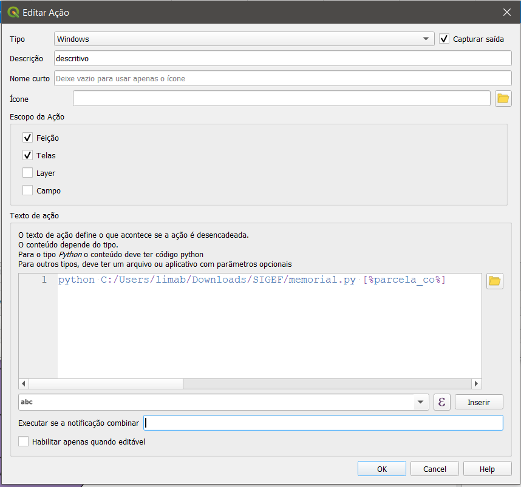

# memorial_descritivo
Script para geração de Memorial Descritivo a partir de PDF gerado pelo SIGEF do INCRA 

Este Scrypt python foi criado para ser executado, incialmente, em ambiente Windows (vamos trabalhar para permitir ser executado também em Linux), necessita da biblioteca <b>tabula</b> para leitura dos dados em PDF, que por sua vez faz uso do JAVA, portanto é necessário acrescentar tanto a biblioteca do python como o o java na máquina. 
  Abordaremos como acrescentar apenas a bilbioteca tabula, mas não abordaremos como instalar o Java, que em princípio a sua máquina já deve ter instalado.  
A sintaxe para execução é a seguinte: 
<b>python memorial.py [código da parcela SIGEF] </b>
<b>Exemplo:  </b>
python memorial.py 84be2b9c-6883-4512-a4c7-03f8b9e494e8  
na ausência do [código da parcela SIGEF] o script irá procurar no mesmo diretório o arquivo de nome <i>document.pdf</i> 

Esse comando pode ser integrado ao QGIS, usando a função nativa do QGIS "Rodar ação de feição" 

  
  
## Link para baixar o shp do SIGEF
Selecionar "Imóvel Certificado SIGEF Total" 
https://certificacao.incra.gov.br/csv_shp/export_shp.py

## Criar ação no QGIS PARA ABRIR O PDF (ABRIR URL)
https://sigef.incra.gov.br/geo/parcela/memorial/[%parcela_co%]/
python C:/Users/limab/Downloads/SIGEF/memorial.py [%parcela_co%]

## Variável de ambiente PATH precisa acrescentar o seguinte valor (necessário para a biblioteca tabula.read_pdf
C:\Program Files (x86)\Common Files\Oracle\Java\javapath;C:\ProgramData\Oracle\Java\javapath
